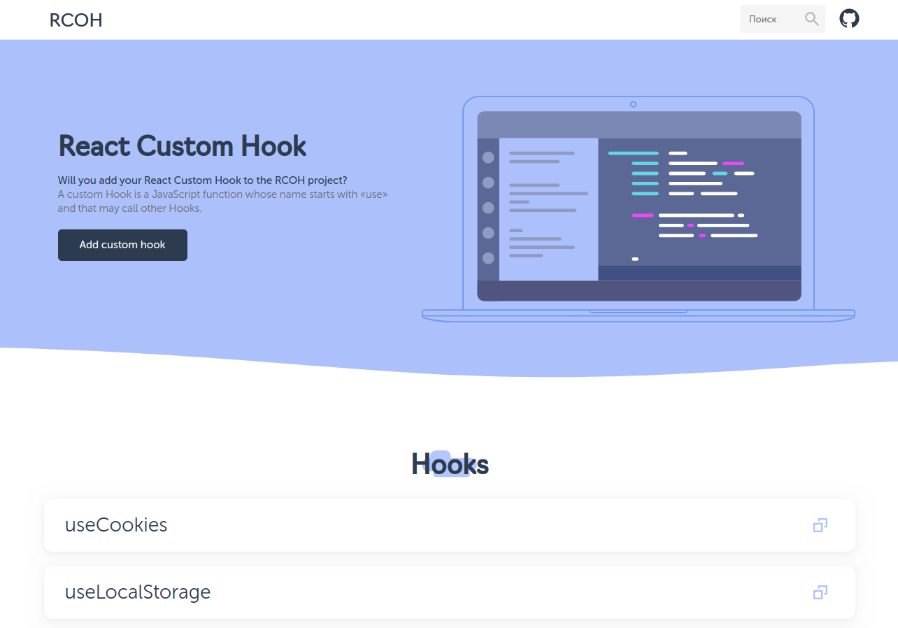

# React custom hooks

Will you add your React Custom Hook to the RCOH project? Let me know!



## Contributing

Pull requests are welcome. To send your own react custom Hook, please
create a markdown file, name it use{{name hook}} and place it in the [collection](https://github.com/varbachakov/rcoh/tree/main/collections/) folder.

## Tech stack

- [Next.js](https://nextjs.org/)
- [Typescript](https://www.typescriptlang.org/)
- Linting with [ESLint](https://eslint.org/)
- Formatting with [Prettier](https://prettier.io/)
- Linting, typechecking and formatting on by default using [`husky`](https://github.com/typicode/husky) for commit hooks
- Testing with [Jest](https://jestjs.io/) and [`react-testing-library`](https://testing-library.com/docs/react-testing-library/intro)

## Running it on local

1. Clone the project:

```console
git clone https://github.com/varbachakov/rcoh.git
```

2. Install the dependencies:

```console
cd rcoh
npm i
```

3. Run it on the local:

```
npm run dev
```

Open http://localhost:3000 in your browser to see it in action.
